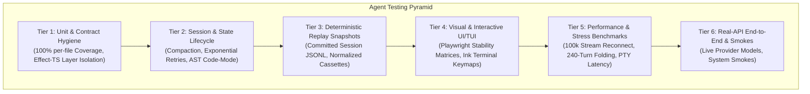
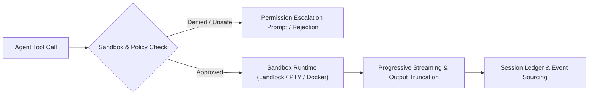
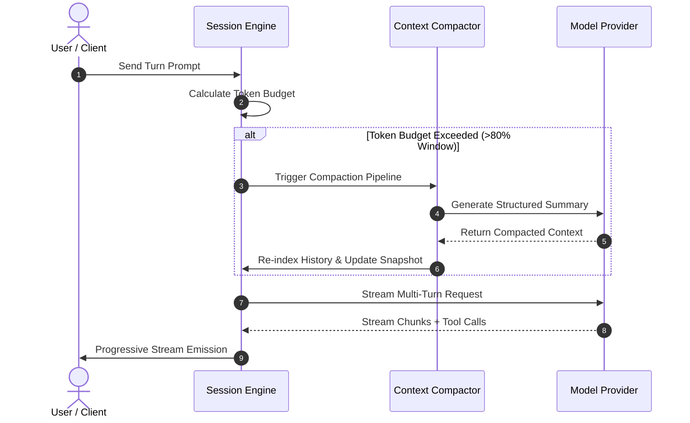
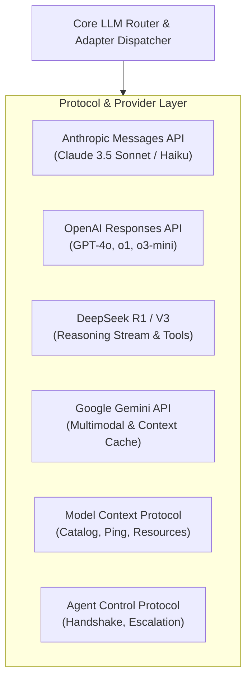
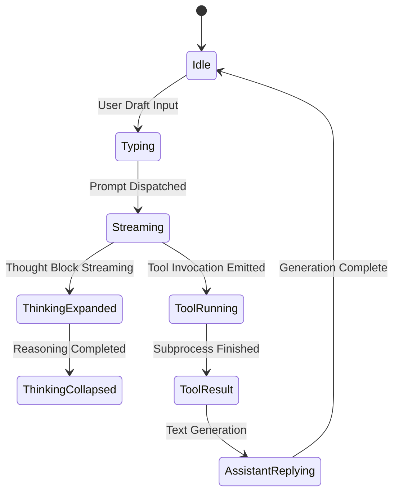
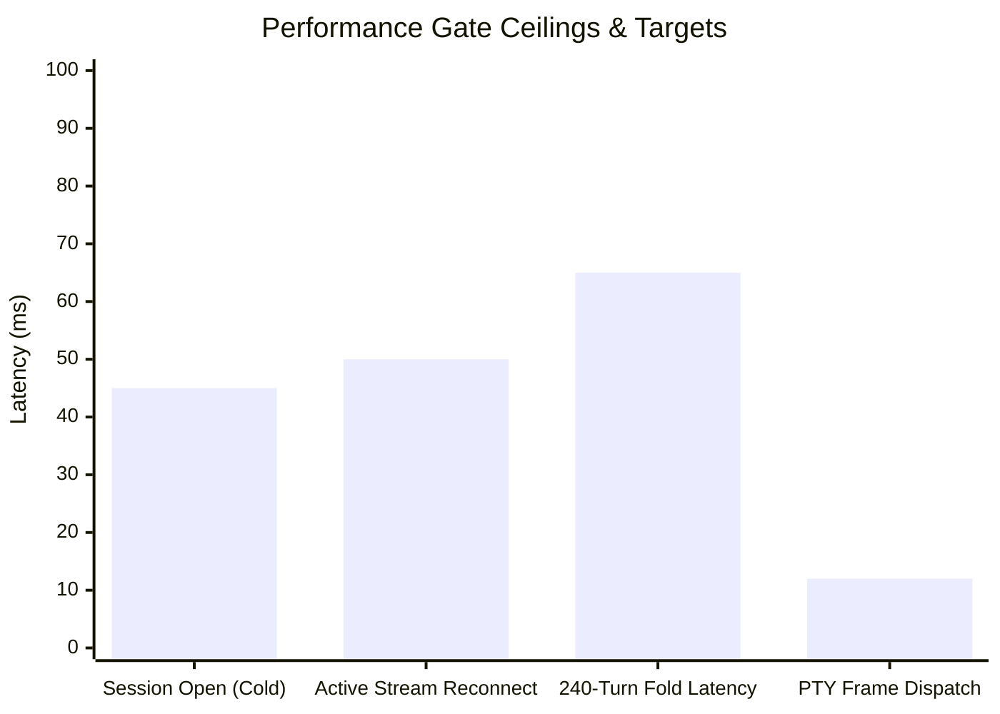
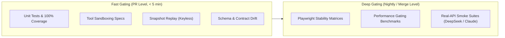

# Test Architecture: Comprehensive Testing Scenarios for Autonomous Agent Systems

> [!NOTE]
> Synthesized testing architecture and scenario catalog derived from **DeepSeek Harness** ([`deepseek-ai/deepseek-harness`](file:///Users/wael/Code/deepseek-harness)) and **Opencode** ([`anomalyco/opencode`](file:///Users/wael/Code/opencode)). This document serves as the reference blueprint for architecting, validating, and benchmarking production-grade agentic AI software.

---

## 1. Architectural Testing Framework & Pyramid

Autonomous agent systems introduce non-deterministic model behavior, stateful multi-turn dialogues, tool-invoked side effects, and complex UI synchronization. Validating these systems requires a multi-tiered testing taxonomy:

### Architectural Comparison of Test Foundations

| Architectural Layer | DeepSeek Harness (`dsh`) | Opencode (`opencode`) |
| :--- | :--- | :--- |
| **Runtime Paradigm** | Cordis Spatiotemporal Plugin Engine (Fibers) | Effect-TS Functional Runtime (Layered Dependency Injection) |
| **Primary Test Framework** | Vitest + Plain Node Runners | Bun Test (`bun:test`) + Playwright |
| **Deterministic Replay** | 188 Committed JSONL Session Snapshots ([`snapshots/`](file:///Users/wael/Code/deepseek-harness/snapshots)) | Recorded Cassette Replays for Provider Inferences |
| **Coverage Requirement** | Strict 100% per-file line coverage gate (`packages/*/*/src`) | Package-level typecheck and Effect runtime contracts |
| **Performance Enforcement** | 6 Synthetic Plain-Node Benchmarks ([`benchmarks/`](file:///Users/wael/Code/deepseek-harness/benchmarks)) | 18 Playwright Timeline Benchmarks ([`perf/test-suite.md`](file:///Users/wael/Code/opencode/perf/test-suite.md)) |

---

## 2. Category 1: Tool Execution & Sandbox Scenarios

Agent execution tools bridge non-deterministic LLM intents with host operating system side effects. Tests must verify input validation, execution safety, sandbox boundaries, and failure isolation.

### 2.1 Shell Execution & Process Isolation Scenarios

| Scenario ID | Scenario Name | Testing Objective & Failure Modes | Verification Invariant |
| :--- | :--- | :--- | :--- |
| `TOOL-SH-01` | **Foreground Command Execution** | Execute basic shell commands (`echo`, `printf`) and capture standard output. | Correct exit code 0, standard out string equality, no trailing garbage. |
| `TOOL-SH-02` | **Standard Error & Exit Code Capture** | Commands emitting stderr or failing with non-zero exit codes (e.g. `cat non_existent_file`). | Stderr captured in output payload; non-zero exit code propagated without throwing unhandled exceptions. |
| `TOOL-SH-03` | **Subprocess Timeout Enforcement** | Commands exceeding configured runtime budget (e.g. `sleep 30` with `timeoutMs=500`). | Immediate process termination via `SIGTERM`/`SIGKILL`; returns `TIMED_OUT` error status. |
| `TOOL-SH-04` | **Background Task Confinement** | Background jobs attempting unauthorized disk writes outside working tree. | Asynchronous Landlock/sandbox interception; task status marks denial; unwritten files remain untouched. |
| `TOOL-SH-05` | **Persistent Shell Session State** | State preservation across sequential commands (e.g. `cd /path`, `export VAR=1`, then `echo $VAR`). | Directory changes and environment variables persist across successive shell tool calls. |
| `TOOL-SH-06` | **PTY Terminal Streaming & Control** | Full PTY terminal allocation, ticket-based auth, resize events, and ANSI escape sequence parsing. | Terminal handles high-frequency output without frame drops; properly handles window resize and Ctrl+C cancellation. |

### 2.2 Filesystem Mutation & Patching Scenarios

| Scenario ID | Scenario Name | Testing Objective & Failure Modes | Verification Invariant |
| :--- | :--- | :--- | :--- |
| `TOOL-FS-01` | **Atomic Write & Parent Creation** | Writing new files to non-existent nested directories (e.g. `src/components/button.tsx`). | Parent directories automatically created; written bytes match payload exactly. |
| `TOOL-FS-02` | **Windowed & Line-Ranged Reads** | Reading large files using `offset` and `limit` boundaries. | Exact line slices returned without loading entire multi-megabyte files into memory. |
| `TOOL-FS-03` | **Single & Multi-Hunk Diff Patching** | Applying unified diffs (`apply_patch`) across single or multiple hunks. | File successfully modified; rejection on conflicting fuzzy matches without corrupting original file. |
| `TOOL-FS-04` | **Contiguous Block Replacement** | Targeted text replacement (`edit`) requiring exact target block matching. | Errors out if target block is non-unique or not found; preserves exact indentation when replaced. |
| `TOOL-FS-05` | **Deletion & Re-creation Lifecycle** | Deleting a file via shell command and verifying subsequent read tool recognition. | File disappears from file tree; subsequent read yields canonical `ENOENT` error. |

### 2.3 Search, AST & Code-Mode Scenarios

| Scenario ID | Scenario Name | Testing Objective & Failure Modes | Verification Invariant |
| :--- | :--- | :--- | :--- |
| `TOOL-AST-01` | **Code-Mode Sandboxed Execution** | Executing programmatic JS/TS scripts in an isolated AST engine (`code-mode`). | Tool calls within scripts execute safely; returns structured inlined data; blocks unauthorized globals. |
| `TOOL-AST-02` | **Grep Boundary & Truncation** | Regex searching across workspace directories with match limits. | Correct match offsets and line numbers returned; excessive output truncated with offset tokens. |
| `TOOL-AST-03` | **Language Server Protocol (LSP)** | Querying language servers for symbol definitions, hover details, and workspace references. | Position-based cursor queries resolve accurate file paths and line ranges. |

---

## 3. Category 2: Agent Session, State & Memory Lifecycle Scenarios

Autonomous agents must survive hours of continuous interaction without context exhaustion, data corruption, or memory leaks.

### 3.1 Context Compaction & Memory Invariants

| Scenario ID | Scenario Name | Testing Objective & Failure Modes | Verification Invariant |
| :--- | :--- | :--- | :--- |
| `SESS-CP-01` | **Threshold Context Compaction** | Context token consumption reaches trigger threshold in long session. | Conversation history compacted into structured summary; crucial instructions and files preserved. |
| `SESS-CP-02` | **Compaction Rollback & Reversion** | User or agent requests reverting last compaction event. | Historical turns restored byte-for-byte; uncompacted state cleanly resumed without duplicate turns. |
| `SESS-CP-03` | **Empty Completion Recovery** | Model returns empty completion or whitespace-only response. | Auto-retry triggered with adjusted prompt or fallback strategy without user disruption. |
| `SESS-CP-04` | **Exponential Backoff with Jitter** | Upstream provider returns HTTP 429 (Rate Limit) or 503 (Overloaded). | Client respects `Retry-After` header; applies exponential backoff with random jitter; avoids thundering herd. |
| `SESS-CP-05` | **Session Concurrency Race Guards** | Parallel tool completion arriving concurrently with user prompt injection. | Event sequencer serializes state changes; prevents orphan assistant messages or interleaved state. |

### 3.2 Hierarchical Subagent Delegation Scenarios

| Scenario ID | Scenario Name | Testing Objective & Failure Modes | Verification Invariant |
| :--- | :--- | :--- | :--- |
| `SUB-DEL-01` | **Foreground Child Agent Spawning** | Parent agent delegates focused task to child subagent synchronously. | Child agent boots isolated workspace context, executes instructions, and returns summary to parent. |
| `SUB-DEL-02` | **Background Asynchronous Delegation** | Parent delegates non-blocking task to background child while proceeding with work. | Background job returns task ID; parent polls or receives reactive notification upon completion. |
| `SUB-DEL-03` | **Recursion Depth Boundary** | Subagents attempting to recursively delegate beyond maximum allowable depth (e.g. depth > 2). | System denies subagent invocation with `DEPTH_LIMIT_REACHED`; parent handles graceful fallback. |
| `SUB-DEL-04` | **Subagent Crash & Error Surfacing** | Child agent crashes, times out, or triggers provider errors. | Error trapped at boundary; surfaces cleanly to parent agent with resumable `task_id`. |

---

## 4. Category 3: LLM Provider & Protocol Interoperability Scenarios

Agent systems must abstract heterogeneous LLM provider protocols, handle prompt caching, and interface with standard tool protocols (MCP, ACP, LSP).

### 4.1 Multi-Provider Adapter & Caching Scenarios

| Scenario ID | Scenario Name | Testing Objective & Failure Modes | Verification Invariant |
| :--- | :--- | :--- | :--- |
| `LLM-PV-01` | **Anthropic Prompt Caching** | Sending multi-turn conversations exceeding 2048/4096 token cache breakpoints. | Cache control flags inserted; provider cache read tokens recorded; subsequent turns verify cache hits. |
| `LLM-PV-02` | **DeepSeek Reasoning Continuation** | Streaming reasoning models emitting chain-of-thought `<think>` blocks before final answer. | Thinking stream separated from message content; persisted in sidecar ledger; UI renders collapsible thought block. |
| `LLM-PV-03` | **OpenAI Encrypted Reasoning** | Responses API handling opaque reasoning payloads across multi-turn continuations. | Encrypted reasoning tokens echoed back in exact continuation sequence without tampering. |
| `LLM-PV-04` | **Multimodal Image Payload Routing** | Prompting with PNG/JPEG/GIF attachments alongside text instructions. | Images correctly encoded as data URLs or multipart attachments; dimensions validated. |
| `LLM-PV-05` | **Structured JSON Schema Enforcement** | Enforcing strict JSON schema responses using provider grammar or native JSON modes. | Streamed output adheres strictly to declared JSON Schema; malformed JSON rejected. |

### 4.2 Standard Protocol Gateway Scenarios (MCP & ACP)

| Scenario ID | Scenario Name | Testing Objective & Failure Modes | Verification Invariant |
| :--- | :--- | :--- | :--- |
| `PROT-MCP-01` | **Dynamic MCP Server Discovery** | Mounting external MCP servers via Stdio/SSE transport. | Tools, resources, and prompts discovered; tool schemas registered into agent runtime without naming collisions. |
| `PROT-MCP-02` | **MCP Resource Template Reading** | Reading dynamic resources (`memo://text`, `memo://binary`) through MCP protocol. | Binary streams handled cleanly without UTF-8 corruption; templates interpolate parameters accurately. |
| `PROT-ACP-01` | **ACP Handshake & Permission Escalation** | Client initiates ACP handshake; agent requests elevated filesystem permissions. | Server approves/rejects escalation; client enforces transition; session continues seamlessly. |

---

## 5. Category 4: User Interface & Visual Stability Scenarios

UI components for agent chat timelines present unique rendering challenges due to rapid high-frequency streaming, collapsible tool rows, diff views, and dynamic viewport resizing.

### 5.1 Terminal UI (TUI) Scenarios

| Scenario ID | Scenario Name | Testing Objective & Failure Modes | Verification Invariant |
| :--- | :--- | :--- | :--- |
| `TUI-INP-01` | **Multi-line Cursor & History Navigation** | Typing multi-line prompts, navigating history with Up/Down keys, and bracketed paste. | History recall intact; newline inserts properly; paste does not prematurely trigger submit. |
| `TUI-DIFF-01` | **Split & Unified Terminal Diff Viewer** | Displaying multi-file git diffs with syntax highlighting in terminal. | Left/right panes aligned; keyboard arrows navigate hunks; terminal resize preserves alignment. |
| `TUI-EVT-01` | **Submission Race & Keymap Cancellation** | User pressing Escape during active generation or submitting prompt during tool stream. | Signal correctly dispatches cancellation; draft preserved; no terminal lockup. |

### 5.2 Web UI & Playwright Visual Stability Scenarios

| Scenario ID | Scenario Name | Testing Objective & Failure Modes | Verification Invariant |
| :--- | :--- | :--- | :--- |
| `WEB-STAB-01` | **Tool Row Shimmer & Mutation Stability** | Tool updates state from pending -> running -> completed during fast streaming. | Row elements update in-place without unmounting, row jumps, or visual shimmering. |
| `WEB-STAB-02` | **Scroll Wheel vs. Streaming Lock** | User scrolling historical turns while agent actively streams new response at bottom. | Viewport does not snap to bottom; user scroll position maintained until manually reset. |
| `WEB-STAB-03` | **Focus Arbitration (Composer vs. Terminal)** | User switching between built-in terminal tab and prompt composer. | Keystrokes strictly routed to focused pane; mounting background terminals does not steal composer focus. |
| `WEB-STAB-04` | **High-DPI Fractional Row Outlines** | Rendering diff cards and shell rows on displays with fractional device scale factors (1.25x, 1.5x). | Virtual row borders render crisp without subpixel clipping or row overlapping. |

---

## 6. Category 5: Performance, Stress & Scaling Benchmark Scenarios

Continuous performance gating prevents latency regression, memory bloat, and browser UI freezes.

### 6.1 Gated Benchmark Matrix

| Benchmark Scenario | Target Workload | Strict Budget / Metric Ceiling | Failure Condition |
| :--- | :--- | :--- | :--- |
| **`BENCH-SESS-OPEN`** | Cold-start parse of historical sessions across V0/V1/V2/V3 JSONL formats. | `< 50ms` parse time; `< 20 MiB` heap delta. | Parser degrades on backwards compatibility layers. |
| **`BENCH-STREAM-RECON`** | Client re-attaching to live stream carrying 100,000 reasoning deltas. | Replacement latency `< 50ms` (63ms ceiling); `< 30 MiB` retained heap after GC. | Memory leak in stream accumulator; UI thread stall. |
| **`BENCH-AGENT-CONT`** | 20 consecutive agent turns with tool executions and state injections. | Step latency growth `< 5%` per turn; total execution overhead `< 100ms`. | Unbounded memory retention across agent loops. |
| **`BENCH-CONV-FOLD`** | Folding deeply nested 50-turn conversation trees into linear context. | Total fold execution `< 80ms`. | Quadratic array allocation during event reduction. |
| **`BENCH-BROWSER-LONG`** | Chromium loading synthetic 240-turn session, navigating history, and typing. | First paint `< 400ms`; typing input delay `< 16ms` (60 FPS responsiveness). | DOM node bloat; virtualization breakdown. |
| **`BENCH-PTY-LATENCY`** | High-throughput terminal burst (10 MB/sec stream emission). | Frame delivery jitter `< 10ms`; zero dropped bytes. | Node event loop saturation; PTY backpressure failure. |

---

## 7. Recommended CI Execution Pipeline

To achieve both rapid feedback and high regression confidence, the testing architecture should be executed in orchestrated pipelines:

1. **Fast Gating**: Executes all unit tests, contract checks, tool suites, and keyless snapshot replays using recorded cassettes (`pnpm run test` + `pnpm run test:snapshot` / `bun test`).
2. **Deep Validation**: Runs the browser Playwright stability suite, plain-Node performance benchmarks, and real-model API integration smokes (`pnpm run test:bench` + `pnpm run test:e2e` / `bun run test:e2e`).
